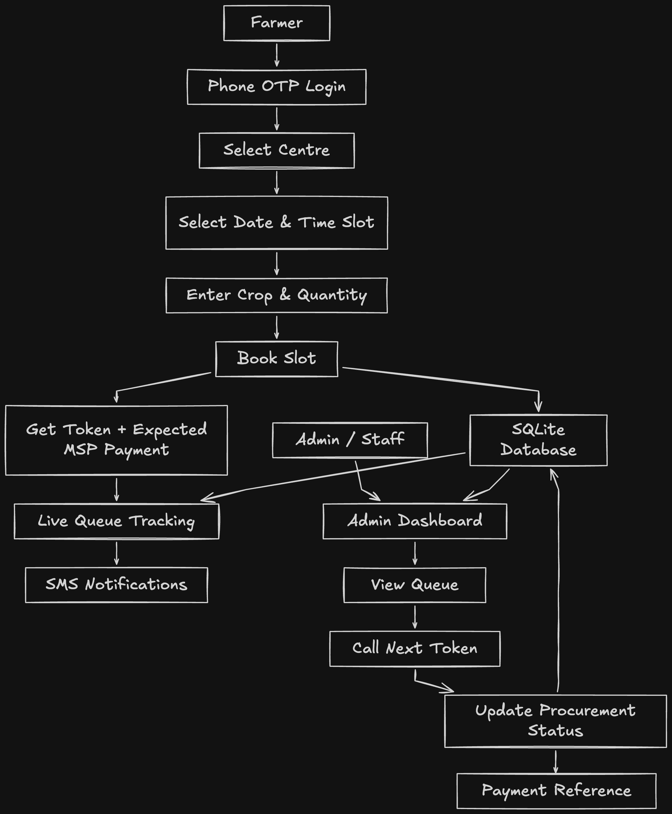

# Procurement Portal

**MSP procurement slot booking and queue management**
Smart India Hackathon 2026 · Problem Statement 26032 · Department of Consumer Affairs, Food & Public Distribution

A farmer who brings paddy or wheat to a government procurement centre today joins an
unmanaged line. He does not know when his turn will come, whether the centre will still
have capacity when it does, or what happened to his crop after it was weighed. Centre
staff have the mirror problem: 200 farmers on one day and 40 on the next, with no way to
plan either.

This project replaces the physical line with a booked time window, a numbered token, a
live queue position, and an SMS at every step through payment. Staff get a dashboard to
call the next token, move bookings down the pipeline, mark no-shows, and change how many
farmers each window can take.

The whole system runs offline on a single laptop. Next.js serves both surfaces, SQLite
holds the data, and SMS is written to a notification log that is visible on screen. No
cloud account or API key is needed to run it.

## What it does

For the farmer, on a phone:

- Log in with a phone number and OTP. An unknown number registers in the same flow (name, village, language).
- Book a slot: centre, date within the next seven days, one of three daily windows, crop and quantity. Each window shows how full it already is.
- Get a token slip with the token number and the amount to expect, calculated as declared quantity times the notified MSP rate for that crop.
- Track the queue: now serving, position in line, estimated wait. The screen refreshes every ten seconds.
- Receive an SMS on booking, on the day-before reminder that staff send out, when three tokens away, and at every status change through payment.

For centre staff, on a desktop:

- Queue board per centre and date, with call-next, status advance, and no-show.
- Slot capacity editor for the day's three windows, and a one-click reminder blast to everyone booked for tomorrow.
- Notification log showing every message the system has sent.
- Wait and service times computed from the recorded event timestamps.

The interface is English and Hindi from a single dictionary (`lib/i18n.ts`). Farmer screens
use large type, large touch targets, a text label beside every icon, and one primary action
per screen. Noto Sans and Noto Sans Devanagari are committed to the repo, so Hindi renders
without a network round trip.

## Quick start

```bash
npm install
npm run demo:reset   # drops the database, recreates the schema, seeds relative to "now"
npm run dev
```

Farmer app at http://localhost:3000, staff dashboard at http://localhost:3000/admin.

Sign in as the seeded farmer with `9876500001` and OTP `123456` (Ramesh Kumar, Hindi
interface). Any other number registers a new farmer. The admin login is `admin` /
`admin123`.

The seed is destructive and computed from the current IST date, so bookings, events, and
timestamps always land around today. Run `npm run demo:reset` again whenever the data has
drifted or a demo is about to start.

## Architecture



A few decisions worth calling out:

**All business logic sits in `lib/services`.** Pages and API routes are thin; they parse a
request, call a service function, and render. The tests exercise that layer directly, and a
future WhatsApp assistant would call the same functions (`bookSlot`, `getQueueStatus`,
`advanceStatus`) rather than reimplementing them.

**Every notification goes through `notify()`.** It writes a `NotificationLog` row and logs
to the console. If `SEND_REAL_SMS=true` and Twilio credentials are set, the same function
also relays a real SMS. One chokepoint means adding a channel does not touch booking or
queue logic.

**Polling, not WebSockets.** Ten-second freshness is enough for a physical queue, it
survives a weak rural connection, it keeps the server stateless, and it behaves identically
with no internet at all.

**Booking is a single transaction.** Capacity is rechecked inside the transaction,
`bookedCount` is incremented, the token is assigned as max plus one, and the amount, the
`BOOKED` event, and the confirmation SMS are written together. A unique constraint on
`(centreId, date, tokenNumber)` backs up the capacity check if two requests race, and the
service retries on a unique-constraint conflict.

**Dates are IST calendar strings.** Slots and bookings store `YYYY-MM-DD` rather than a
timestamp, so "today" means the same thing regardless of the laptop's clock or timezone.

**SQLite now, Postgres later.** The schema avoids SQLite-only features. Status is a `String`
column plus a TypeScript union (`lib/status.ts`) because Prisma enums are unavailable on
SQLite, so moving to Postgres is a datasource change rather than a rewrite.

### Status pipeline

```
BOOKED → ARRIVED → SERVING → WEIGHED → PROCURED → PAYMENT_INITIATED → PAID
    ↘ NO_SHOW (from BOOKED or ARRIVED)
    ↘ CANCELLED (from BOOKED, admin only, frees the seat)
```

Each transition appends a `BookingEvent` row and sends one SMS. Skipping a step is
rejected. A payment reference is generated at `PAYMENT_INITIATED`, and the `PAID` message
carries the amount and that reference.

Queue position counts the waiting bookings (`BOOKED` or `ARRIVED`) with a lower token at
the same centre on the same date. The estimated wait is that position times the centre's
average service time.

### Data model

Seven tables in `prisma/schema.prisma`: `Farmer`, `Centre`, `Slot`, `Booking`,
`BookingEvent`, `NotificationLog`, `CropRate`. `Booking` denormalizes `centreId` and `date`
from its slot so the queue queries, which run on every poll, avoid a join.

## Project layout

```
app/
  page.tsx                 farmer home: today's booking, token, live position
  login/                   phone + OTP, registration folded in
  book/                    centre → date → window → crop → confirm
  bookings/[id]/           token slip and live tracker
  admin/(dash)/            queue board, slot editor, notification log
  api/                     farmer and admin routes
lib/
  services/                all business logic, tested here
  i18n.ts  status.ts  dates.ts  messages.ts
components/                token slip, token card, icons
prisma/                    schema and the demo seed
tests/                     Vitest suites against the service layer
```

## Tests

```bash
npm test        # 18 Vitest cases
npm run typecheck
```

Each suite gets a throwaway SQLite file copied from a template database, so the suites do
not share state. Coverage is at the service seam: token sequencing, capacity rejection,
event and SMS side effects, the full status pipeline and its invalid jumps, the
three-tokens-away message firing exactly once, queue position and now-serving arithmetic,
capacity edits, and the reminder blast.

The concurrency case fires nine simultaneous bookings at a window with five seats. Five
succeed with tokens 1 to 5, four are rejected.

## Configuration

Copy `.env.example` to `.env`. The defaults run the full demo.

| Variable | Default | Purpose |
|---|---|---|
| `DATABASE_URL` | `file:./dev.db?connection_limit=1&socket_timeout=30` | SQLite file |
| `MOCK_MODE` | `true` | Accepts `123456` as the OTP for any number. With it off, login is refused rather than silently accepted, since v1 ships no OTP gateway |
| `SEND_REAL_SMS` | `false` | Relay notifications to Twilio as well as the log |
| `TWILIO_ACCOUNT_SID` | | Required only when `SEND_REAL_SMS=true` |
| `TWILIO_AUTH_TOKEN` | | |
| `TWILIO_SMS_FROM` | | |

## Seeded data

`npm run demo:reset` creates three Uttar Pradesh centres (Rampur, Shahjahanpur, Hardoi)
with different daily capacities and service times, forty farmers, slots for three days
either side of today, and bookings spread across every status with their event chains and
notification trails. The random number generator is seeded, so two resets on the same day
produce the same world.

MSP rates are the CCEA-notified figures for KMS and RMS 2026-27: paddy common 2,441 and
grade A 2,461, wheat 2,585, maize 2,410, bajra 2,900 rupees per quintal.

## Scope

Version 1 tracks procurement status and the payable amount. It does not move money;
disbursal through PFMS is out of scope. Also deliberately left out: Aadhaar and eKYC
(phone OTP is the lower-friction on-ramp, and eKYC is an addition at registration rather
than a redesign), native apps, role-based access control for staff, and farmer-side
cancellation. SMS templates are English only in v1 even though the interface is bilingual,
because the template layer is a single module and localized templates drop in later.

Planned next: a WhatsApp assistant calling the existing service functions, voice and IVR
for farmers without a smartphone, and localized message templates.

## Stack

Next.js 15 (App Router), React 19, TypeScript, Tailwind CSS v4, Prisma with SQLite, and
Vitest. Four runtime dependencies in total.
