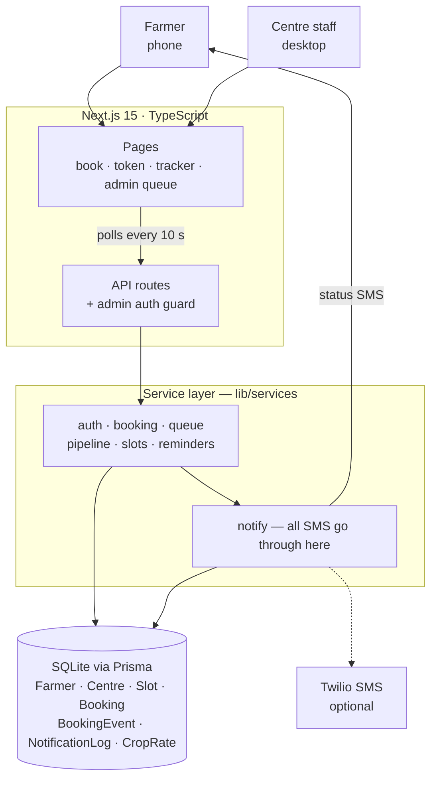

# System architecture

**How to read it:** the farmer books a slot and gets a token; his tracker asks
the server every 10 seconds for his position and ETA. Staff move tokens down the
pipeline `BOOKED → ARRIVED → SERVING → WEIGHED → PROCURED → PAYMENT_INITIATED →
PAID`. Every step writes an event row and sends one SMS. All logic lives in the
service layer, so a future WhatsApp bot calls the same functions the web pages do.
